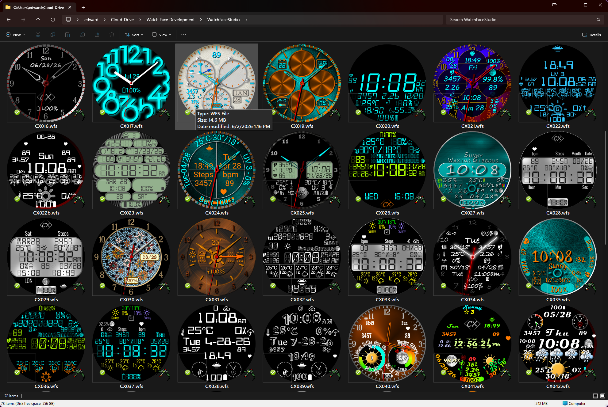

# CX Watch Face Thumbnails

Windows Explorer thumbnail support for Samsung Watch Face Studio projects and packaged Wear OS watch faces.

CX Watch Face Thumbnails adds native thumbnail previews to Windows Explorer, allowing you to visually identify your watch faces without opening each file in Watch Face Studio.

## Supported File Types

- `.wfs` — Samsung Watch Face Studio project files
- `.apk` — Android application packages containing compatible watch faces
- `.aab` — Android App Bundles containing compatible watch faces

## Features

- Displays the actual watch face preview directly in Windows Explorer
- Supports WFS, APK, and AAB files
- Resolves Android resource-table mappings for obfuscated APK preview images
- Correctly handles case-sensitive APK resource names
- Supports APK resources whose physical filenames differ only by letter case
- Improved fallback handling for packaged watch face previews
- Integrates directly with the Windows Explorer thumbnail system
- No need to modify your Watch Face Studio installation
- Does not change your existing file associations
- Lightweight 64-bit Windows shell extension

## What's New in v1.0.2

- Added support for APK watch faces whose preview image is stored under an obfuscated Android resource filename
- Added Android `resources.arsc` preview-resource resolution
- Added case-sensitive ZIP resource handling
- Fixed APK packages containing resources whose filenames differ only by capitalization
- Improved preview fallback handling for WFS, APK, and AAB files
- Fixes watch faces that previously displayed a generic icon instead of the actual packaged preview

## Installation

1. Download the latest release.
2. Extract the ZIP file to a temporary folder.
3. Run `Install.cmd`.
4. Windows Explorer will begin displaying watch face thumbnails.

The installer copies and registers the thumbnail provider automatically.

If a previous version is installed, the installer replaces it with the updated version.

## Uninstallation

Run `Uninstall.cmd`.

The thumbnail provider will be unregistered and removed from your system.

## Requirements

- 64-bit Windows
- Samsung Watch Face Studio files or compatible Wear OS APK/AAB packages

No separate installation of Watch Face Studio, Java, Android SDK, ADB, or 7-Zip is required for thumbnail generation.

## Screenshot

CX Watch Face Thumbnails replaces generic file icons with previews of the actual watch faces, making large watch face collections much easier to browse.

## Source Code

CX Watch Face Thumbnails is currently distributed as a compiled Windows shell extension.

Source code is not included in the current release. Source availability may be considered in the future.

## Author

**Edward A. Ludwig**  
**Creative eXtremes**

## Disclaimer

This project is an independent utility and is not affiliated with or endorsed by Samsung Electronics.

Samsung and Watch Face Studio are trademarks of their respective owners.
